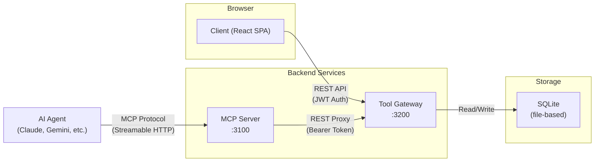
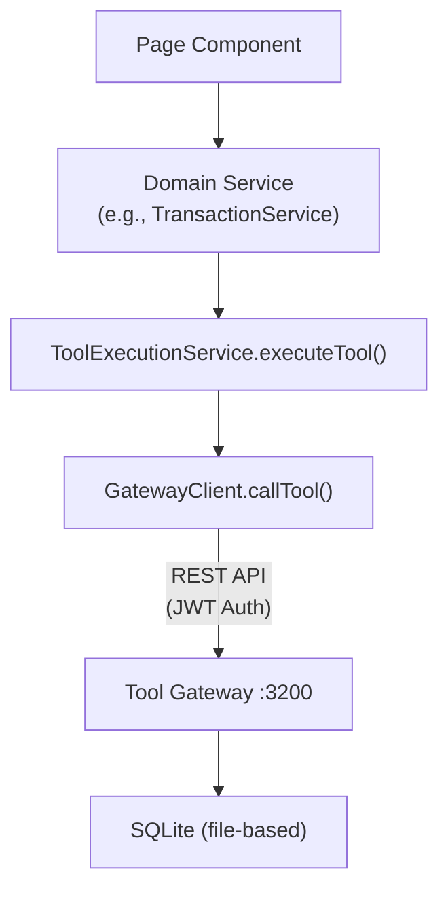
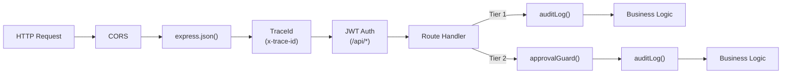
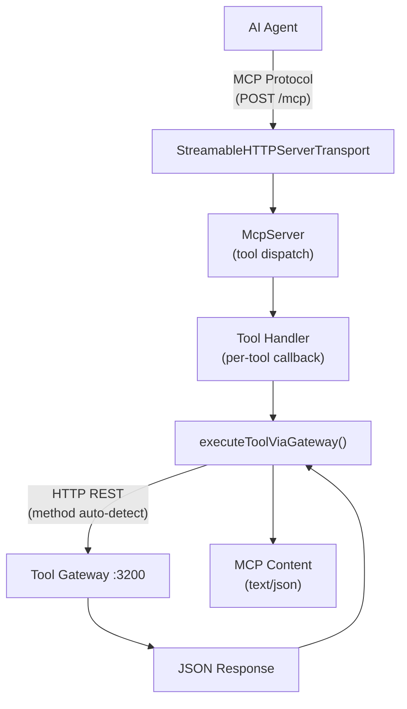
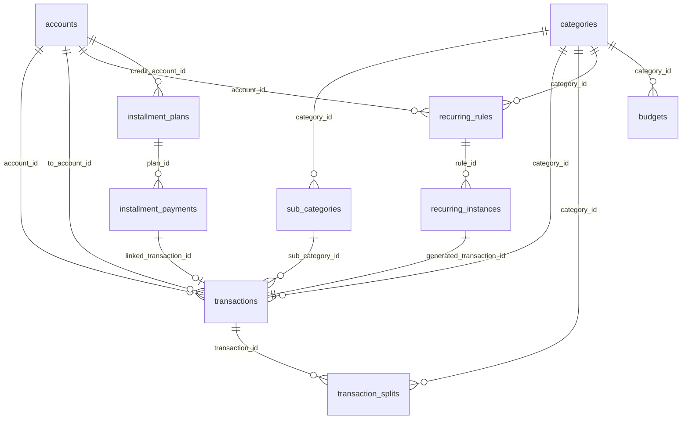
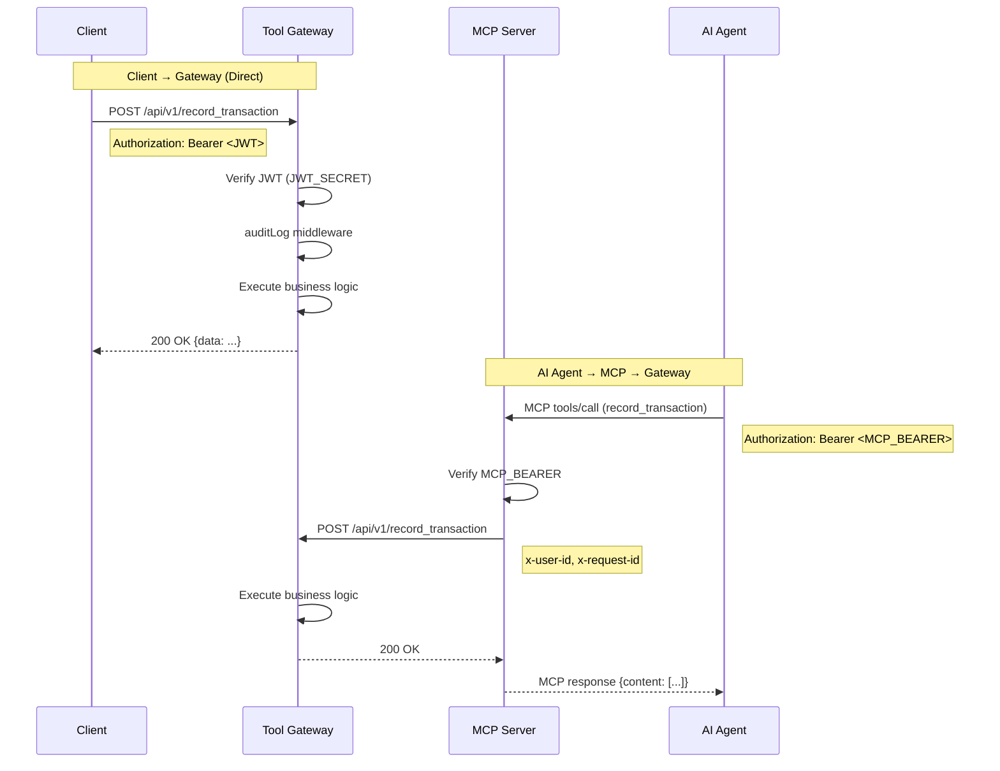
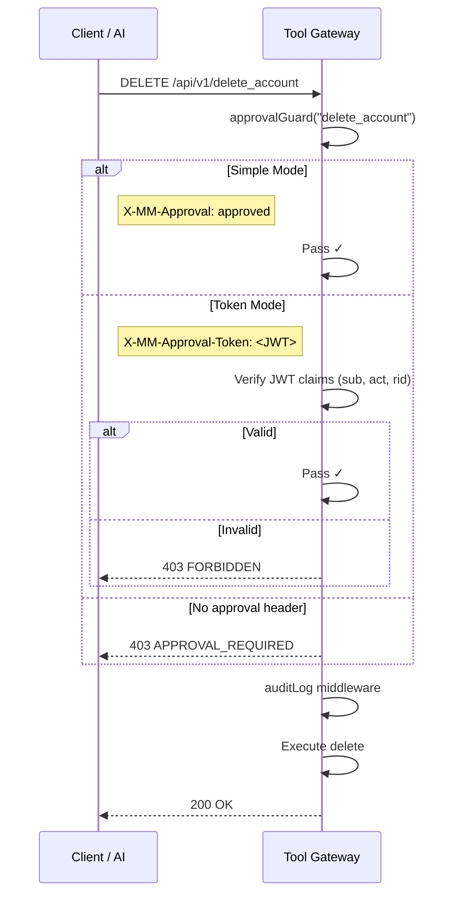
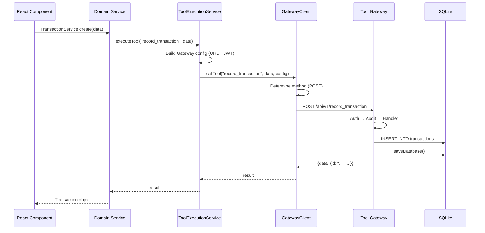
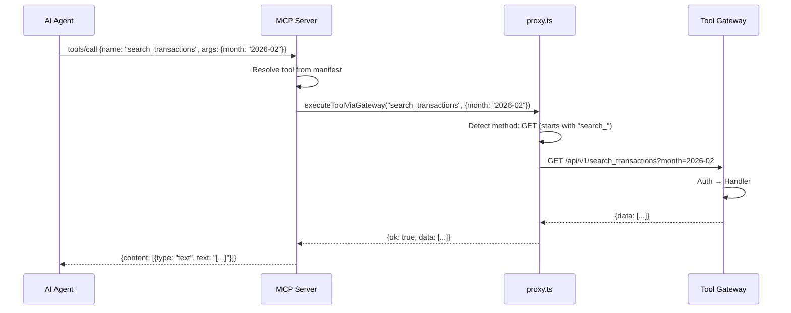

# Money Manager 2 — System Architecture Documentation

## 1. Tổng quan hệ thống

Money Manager 2 (MM2) là ứng dụng quản lý tài chính cá nhân được thiết kế theo kiến trúc **3-tier (thin-client)**, bao gồm:



| Component | Tech Stack | Port | Vai trò |
|-----------|-----------|------|---------|
| **Client** | React 19, Vite 7, TailwindCSS 4, TypeScript | `:5173` (dev) | Giao diện người dùng (thin-client SPA) |
| **Tool Gateway** | Express 5, sql.js, JWT, TypeScript | `:3200` | REST API, business logic, data layer |
| **MCP Server** | `@modelcontextprotocol/sdk`, Express 5, TypeScript | `:3100` | Cung cấp giao diện MCP cho AI agents |

---

## 2. Client (React SPA)

### 2.1 Công nghệ

- **Framework**: React 19 + Vite 7
- **Styling**: TailwindCSS 4, `clsx`, `tailwind-merge`
- **Routing**: React Router DOM 7
- **Charts**: Recharts 3
- **Icons**: Lucide React
- **Date**: date-fns 4, react-day-picker 9
> [!NOTE]
> Kể từ bản cập nhật 2026-02-28, Client **không còn** chứa database in-browser. Mọi read/write đều thông qua Tool Gateway.

### 2.2 Cấu trúc thư mục

```
src/
├── api/
│   └── gateway.ts           # GatewayClient — HTTP client gọi Tool Gateway
├── components/
│   ├── Layout.tsx            # AppLayout (sidebar + main content)
│   ├── accounts/             # AccountList, AccountForm
│   ├── auth/                 # AuthLock (password lock screen)
│   ├── budget/               # Budget components
│   ├── common/               # Toast, UndoProvider, DateProvider, MonthPicker, ConfirmDialog
│   ├── dashboard/            # SummaryCards, charts, QuickActions
│   ├── installments/         # InstallmentForm
│   ├── recurring/            # RecurringForm
│   ├── settings/             # Data management, password, display settings
│   ├── transactions/         # TransactionList, TransactionForm, CategoryPicker
│   └── ui/                   # Reusable UI components
├── pages/                    # 13 page components
│   ├── DashboardPage.tsx     # Trang chủ — thống kê tổng quan
│   ├── AccountsPage.tsx      # Quản lý tài khoản
│   ├── TransactionsPage.tsx  # Danh sách giao dịch
│   ├── CategoryPage.tsx      # Quản lý danh mục
│   ├── RecurringPage.tsx     # Giao dịch định kỳ
│   ├── InstallmentPage.tsx   # Trả góp
│   ├── AnalyticsPage.tsx     # Phân tích chi tiêu
│   ├── BudgetPage.tsx        # Ngân sách
│   ├── ForecastPage.tsx      # Dự báo tài chính
│   ├── ForecastDetailPage.tsx # Chi tiết dự báo theo tháng
│   ├── TrendsPage.tsx        # Xu hướng và so sánh
│   ├── AuditLogPage.tsx      # Nhật ký hoạt động
│   └── SettingsPage.tsx      # Cài đặt
├── services/
│   ├── ToolExecutionService.ts  # ★ Core: Gateway-only tool dispatcher
│   ├── AccountService.ts        # Proxy → ToolExecutionService
│   ├── TransactionService.ts    # Proxy → ToolExecutionService
│   ├── CategoryService.ts       # Proxy → ToolExecutionService
│   ├── BudgetService.ts         # Proxy → ToolExecutionService
│   ├── RecurringService.ts      # Proxy → ToolExecutionService
│   ├── InstallmentService.ts    # Proxy → ToolExecutionService
│   ├── StatisticsService.ts     # Proxy → ToolExecutionService
│   ├── ForecastService.ts       # Proxy → ToolExecutionService
│   ├── SettingsService.ts       # Proxy → ToolExecutionService
│   ├── AuditService.ts          # Proxy → ToolExecutionService
│   ├── BackupService.ts         # Backup/restore logic
│   └── ImportExportService.ts   # Import/export JSON
└── utils/
    └── ...
```

### 2.3 Kiến trúc Gateway-Only (Thin Client)

Client hoạt động hoàn toàn như **thin client** — không chứa database hay business logic xử lý dữ liệu. Mọi thao tác đều đi qua `ToolExecutionService` → `GatewayClient` → Tool Gateway.



- Tất cả tool calls đều proxy qua `GatewayClient.callTool()` đến Tool Gateway
- Config lưu trong `localStorage` (optional overrides):
  - `mm2_gateway_url`: URL của gateway (default `http://localhost:3200`)
  - `mm2_gateway_token`: JWT token (có fallback token mặc định cho dev)
- Token hết hạn sẽ tự động bị xóa khỏi localStorage, fallback về token mặc định

> [!IMPORTANT]
> Local mode (in-browser SQLite) đã bị loại bỏ hoàn toàn kể từ commit `52fefc7` (2026-02-28). Thư mục `src/db/` và `src/services/local/` là legacy code, không còn được import hay sử dụng.

### 2.4 Routing

| Path | Page | Mô tả |
|------|------|-------|
| `/` | → `/dashboard` | Redirect |
| `/dashboard` | `DashboardPage` | Thống kê tổng quan, biểu đồ |
| `/accounts` | `AccountsPage` | CRUD tài khoản |
| `/transactions` | `TransactionsPage` | Danh sách giao dịch |
| `/categories` | `CategoryPage` | Danh mục / danh mục con |
| `/recurring` | `RecurringPage` | Quy tắc định kỳ |
| `/installments` | `InstallmentPage` | Kế hoạch trả góp |
| `/analytics` | `AnalyticsPage` | Phân tích chi tiêu |
| `/budget` | `BudgetPage` | Ngân sách theo tháng |
| `/forecast` | `ForecastPage` | Dự báo tài chính |
| `/forecast/:month` | `ForecastDetailPage` | Chi tiết tháng |
| `/settings` | `SettingsPage` | Cài đặt hệ thống |
| `/audit-logs` | `AuditLogPage` | Nhật ký kiểm tra |

### 2.5 Provider Hierarchy

```
BrowserRouter
  └── AuthLock             # Màn hình khoá / mật khẩu
      └── ToastProvider    # Thông báo toast
          └── DateProvider  # Context tháng/năm hiện tại
              └── UndoProvider  # Undo giao dịch
                  └── Routes
                      └── AppLayout (sidebar + content)
```

---

## 3. Tool Gateway (REST API)

### 3.1 Công nghệ

- **Runtime**: Node.js
- **Framework**: Express 5
- **Database**: sql.js (SQLite file-based)
- **Auth**: JWT (`jsonwebtoken`)
- **Validation**: Zod

### 3.2 Cấu trúc thư mục

```
tool-gateway/
├── src/
│   ├── server.ts              # Entry point, Express app setup
│   ├── db/
│   │   ├── client.ts          # sql.js wrapper (init, all, get, run, exec, transaction, saveDatabase)
│   │   └── schema.sql         # DDL schema (11 tables)
│   ├── middleware/
│   │   ├── auth.ts            # JWT authentication middleware
│   │   ├── audit.ts           # Audit logging middleware (ghi log mọi thao tác Tier 1+)
│   │   └── approval.ts        # Tier 2 approval guard (X-MM-Approval-Token)
│   ├── routes/
│   │   ├── accounts.ts        # Account CRUD
│   │   ├── categories.ts      # Category + SubCategory CRUD
│   │   ├── transactions.ts    # Transaction CRUD + bulk ops
│   │   ├── budgets.ts         # Budget CRUD
│   │   ├── analytics.ts       # Statistics & analytics queries
│   │   ├── recurring.ts       # Recurring rules + instance generation
│   │   ├── installments.ts    # Installment plans + payments
│   │   └── system.ts          # Settings, audit logs, import/export
│   └── services/
│       ├── AccountService.ts
│       ├── TransactionService.ts
│       ├── CategoryService.ts
│       ├── BudgetService.ts
│       ├── RecurringService.ts
│       ├── InstallmentService.ts
│       └── StatisticsService.ts
├── data/
│   └── mm2.db                 # SQLite database file
└── .env
```

### 3.3 Middleware Pipeline



#### Authentication ([auth.ts](file:///d:/Projects/mm2/tool-gateway/src/middleware/auth.ts))
- Validates `Authorization: Bearer <JWT>` header
- Decodes JWT using `JWT_SECRET` environment variable
- Attaches `req.user = { userId }` for downstream use

#### Audit Logging ([audit.ts](file:///d:/Projects/mm2/tool-gateway/src/middleware/audit.ts))
- Factory function [auditLog(toolName, tier, resourceType)](file:///d:/Projects/mm2/tool-gateway/src/middleware/audit.ts#5-48) tạo middleware
- Intercepts `res.json()` để ghi log *sau* khi response đã chuẩn bị
- Ghi vào bảng `audit_logs` với: trace_id, user, tool_name, tier, resource_type, result, error_code

#### Approval Guard ([approval.ts](file:///d:/Projects/mm2/tool-gateway/src/middleware/approval.ts))
- Dùng cho endpoints **Tier 2** (destructive operations)
- Hỗ trợ 2 chế độ:
  - **Simple mode**: Header `X-MM-Approval: approved` (dùng khi MCP server đã xác nhận)
  - **Token mode**: Header `X-MM-Approval-Token: <JWT>` chứa claims `{sub, act, rid, exp, nonce}`
  - Verify: user match + action match + token validity

### 3.4 API Endpoints

Tất cả endpoints nằm dưới prefix `/api/v1/`. Tool name = endpoint path.

#### Accounts
| Method | Endpoint | Tool Name | Tier | Mô tả |
|--------|----------|-----------|------|-------|
| GET | `/get_accounts` | `get_accounts` | 0 | Lấy danh sách tài khoản |
| GET | `/get_account_balances` | `get_account_balances` | 0 | Số dư tài khoản |
| POST | `/create_account` | `create_account` | 1 | Tạo tài khoản |
| POST | `/update_account` | `update_account` | 1 | Cập nhật tài khoản |
| DELETE | `/delete_account` | `delete_account` | 2 | Xóa tài khoản |

#### Categories
| Method | Endpoint | Tool Name | Tier | Mô tả |
|--------|----------|-----------|------|-------|
| GET | `/get_categories` | `get_categories` | 0 | Lấy danh mục + danh mục con |
| POST | `/create_category` | `create_category` | 1 | Tạo danh mục |
| POST | `/create_subcategory` | `create_subcategory` | 1 | Tạo danh mục con |
| POST | `/update_category` | `update_category` | 1 | Đổi tên danh mục |
| POST | `/update_subcategory` | `update_subcategory` | 1 | Đổi tên danh mục con |
| POST | `/move_subcategory` | `move_subcategory` | 1 | Di chuyển danh mục con |
| DELETE | `/delete_category` | `delete_category` | 2 | Xóa danh mục |
| DELETE | `/delete_subcategory` | `delete_subcategory` | 2 | Xóa danh mục con |

#### Transactions
| Method | Endpoint | Tool Name | Tier | Mô tả |
|--------|----------|-----------|------|-------|
| GET | `/search_transactions` | `search_transactions` | 0 | Tìm kiếm giao dịch (filter) |
| POST | `/record_transaction` | `record_transaction` | 1 | Tạo giao dịch |
| POST | `/update_transaction` | `update_transaction` | 1 | Cập nhật giao dịch |
| POST | `/update_transaction_status` | `update_transaction_status` | 1 | Đổi trạng thái |
| POST | `/transfer_funds` | `transfer_funds` | 1 | Chuyển khoản |
| POST | `/restore_transaction` | `restore_transaction` | 1 | Khôi phục giao dịch đã xóa |
| POST | `/bulk_restore_transactions` | `bulk_restore_transactions` | 1 | Khôi phục hàng loạt |
| DELETE | `/delete_transaction` | `delete_transaction` | 2 | Xóa mềm (soft delete) |
| POST | `/bulk_delete_transactions` | `bulk_delete_transactions` | 2 | Xóa hàng loạt |

#### Budgets
| Method | Endpoint | Tool Name | Tier | Mô tả |
|--------|----------|-----------|------|-------|
| GET | `/get_budgets` | `get_budgets` | 0 | Ngân sách theo tháng |
| GET | `/get_monthly_summary` | `get_monthly_summary` | 0 | Tóm tắt tháng |
| POST | `/set_category_budget` | `set_category_budget` | 1 | Đặt ngân sách cho danh mục |
| POST | `/clone_month_budget` | `clone_month_budget` | 1 | Clone ngân sách sang tháng khác |
| POST | `/generate_budgets_from_automation` | `generate_budgets_from_automation` | 1 | Tạo tự động từ recurring/installments |
| DELETE | `/delete_budget` | `delete_budget` | 2 | Xóa ngân sách |
| DELETE | `/clear_month_budgets` | `clear_month_budgets` | 2 | Xóa toàn bộ ngân sách tháng |

#### Analytics
| Method | Endpoint | Tool Name | Tier | Mô tả |
|--------|----------|-----------|------|-------|
| GET | `/get_dashboard_summary` | `get_dashboard_summary` | 0 | Tổng quan dashboard |
| GET | `/get_spending_analytics` | `get_spending_analytics` | 0 | Chi tiêu theo danh mục |
| GET | `/get_cashflow_trend` | `get_cashflow_trend` | 0 | Xu hướng dòng tiền |
| GET | `/get_daily_spending` | `get_daily_spending` | 0 | Chi tiêu hàng ngày |
| GET | `/get_category_movers` | `get_category_movers` | 0 | So sánh danh mục |
| GET | `/get_pending_summary` | `get_pending_summary` | 0 | Tóm tắt giao dịch pending |
| GET | `/get_upcoming_payments` | `get_upcoming_payments` | 0 | Thanh toán sắp tới |

#### Recurring
| Method | Endpoint | Tool Name | Tier | Mô tả |
|--------|----------|-----------|------|-------|
| GET | `/get_recurring_rules` | `get_recurring_rules` | 0 | Danh sách quy tắc |
| GET | `/get_recurring_instances` | `get_recurring_instances` | 0 | Danh sách instances |
| POST | `/create_recurring_rule` | `create_recurring_rule` | 1 | Tạo quy tắc |
| POST | `/update_recurring_rule` | `update_recurring_rule` | 1 | Cập nhật quy tắc |
| POST | `/trigger_recurring_instance` | `trigger_recurring_instance` | 1 | Trigger thủ công |
| POST | `/generate_recurring_instances` | `generate_recurring_instances` | 1 | Tạo instances tự động |
| DELETE | `/delete_recurring_rule` | `delete_recurring_rule` | 2 | Xóa quy tắc |

#### Installments
| Method | Endpoint | Tool Name | Tier | Mô tả |
|--------|----------|-----------|------|-------|
| GET | `/get_installment_plans` | `get_installment_plans` | 0 | Danh sách kế hoạch |
| GET | `/get_installment_schedule` | `get_installment_schedule` | 0 | Lịch thanh toán |
| POST | `/create_installment_plan` | `create_installment_plan` | 1 | Tạo kế hoạch trả góp |
| POST | `/pay_installment` | `pay_installment` | 1 | Đánh dấu đã thanh toán |
| POST | `/check_overdue_installments` | `check_overdue_installments` | 1 | Kiểm tra quá hạn |
| DELETE | `/delete_installment_plan` | `delete_installment_plan` | 2 | Xóa kế hoạch |

#### System
| Method | Endpoint | Tool Name | Tier | Mô tả |
|--------|----------|-----------|------|-------|
| GET | `/get_settings` | `get_settings` | 0 | Lấy cài đặt |
| GET | `/has_password` | `has_password` | 0 | Kiểm tra mật khẩu |
| GET | `/get_audit_logs` | `get_audit_logs` | 0 | Nhật ký |
| GET | `/get_financial_forecast` | `get_financial_forecast` | 0 | Dự báo tài chính |
| GET | `/get_forecast_details` | `get_forecast_details` | 0 | Chi tiết dự báo |
| POST | `/set_date_format` | `set_date_format` | 1 | Đặt định dạng ngày |
| POST | `/set_lock_enabled` | `set_lock_enabled` | 1 | Bật/tắt khoá |
| POST | `/set_password` | `set_password` | 2 | Đặt mật khẩu |
| POST | `/verify_password` | `verify_password` | 0 | Xác thực mật khẩu |
| POST | `/export_system_data` | `export_system_data` | 1 | Xuất dữ liệu |
| POST | `/import_system_data` | `import_system_data` | 2 | Nhập dữ liệu |

### 3.5 Database Client ([db/client.ts](file:///d:/Projects/mm2/src/db/client.ts))

Wrapper cho sql.js cung cấp các helper:

| Function | Mô tả |
|----------|-------|
| [initDatabase()](file:///d:/Projects/mm2/tool-gateway/src/db/client.ts#12-63) | Khởi tạo DB: load file nếu tồn tại, chạy schema, chạy migrations |
| `all<T>(sql, params)` | SELECT → mảng rows |
| `get<T>(sql, params)` | SELECT → row đầu tiên hoặc undefined |
| [run(sql, params)](file:///d:/Projects/mm2/tool-gateway/src/db/client.ts#90-95) | INSERT/UPDATE/DELETE, auto-save nếu ngoài transaction |
| [exec(sql)](file:///d:/Projects/mm2/tool-gateway/src/db/client.ts#96-101) | Multi-statement SQL, auto-save |
| `transaction<T>(fn)` | BEGIN/COMMIT/ROLLBACK wrapper, save sau COMMIT |
| [saveDatabase()](file:///d:/Projects/mm2/tool-gateway/src/db/client.ts#64-69) | Export & ghi file `.db` ra disk |

> [!IMPORTANT]
> Mỗi lệnh [run()](file:///d:/Projects/mm2/tool-gateway/src/db/client.ts#90-95)/[exec()](file:///d:/Projects/mm2/tool-gateway/src/db/client.ts#96-101) ngoài transaction sẽ tự động gọi [saveDatabase()](file:///d:/Projects/mm2/tool-gateway/src/db/client.ts#64-69) để persist dữ liệu ra file. Trong transaction, chỉ save sau COMMIT.

### 3.6 Environment Variables

| Variable | Default | Mô tả |
|----------|---------|-------|
| `PORT` | `3200` | Cổng HTTP |
| `JWT_SECRET` | — | Secret cho JWT authentication |
| `APPROVAL_TOKEN_SECRET` | — | Secret cho approval tokens (Tier 2) |
| `DB_PATH` | `./data/mm2.db` | Đường dẫn file SQLite |
| `LOG_LEVEL` | `info` | Mức log |
| `REQUEST_SIZE_LIMIT` | `5mb` | Giới hạn body size |

---

## 4. MCP Server

### 4.1 Công nghệ

- **MCP SDK**: `@modelcontextprotocol/sdk` 1.12
- **Transport**: Streamable HTTP (SSE cho server → client)
- **Framework**: Express 5
- **Schema**: Zod (dynamic schema generation từ manifest)

### 4.2 Cấu trúc thư mục

```
mcp-server/
├── src/
│   ├── server.ts              # Entry point: MCP server + Express app
│   ├── toolRegistry.ts        # Load & validate tools_manifest_v1.json
│   ├── proxy.ts               # executeToolViaGateway() — proxy HTTP calls
│   ├── security.ts            # Auth + Identity + Approval guard middleware
│   └── logger.ts              # Structured JSON logging with redaction
├── tools_manifest_v1.json     # ★ Tool definitions (38KB, ~50+ tools)
└── .env
```

### 4.3 Kiến trúc



### 4.4 Tool Registry ([toolRegistry.ts](file:///d:/Projects/mm2/mcp-server/src/toolRegistry.ts))

Đọc file [tools_manifest_v1.json](file:///d:/Projects/mm2/mcp-server/tools_manifest_v1.json) và:
1. **Validate** tên tool duy nhất, tier hợp lệ (0/1/2), parameters hợp lệ
2. **Normalize** schema (thêm `type: 'object'` nếu thiếu)
3. **Derive annotations** theo tier:
   - Tier 0: `readOnlyHint: true`
   - Tier 1: `destructiveHint: false`
   - Tier 2: `destructiveHint: true`

### 4.5 Proxy ([proxy.ts](file:///d:/Projects/mm2/mcp-server/src/proxy.ts))

[executeToolViaGateway(toolName, args, context)](file:///d:/Projects/mm2/mcp-server/src/proxy.ts#14-129):
- Tự động xác định HTTP method:
  - `get_*`, `search_*`, `has_password` → **GET** (params chuyển thành query string)
  - `delete_*`, `clear_*` (danh sách cụ thể) → **DELETE**
  - Còn lại → **POST**
- URL: `{MM_API_BASE_URL}/api/v1/{toolName}`
- Headers: `x-user-id`, `x-request-id`, `idempotency-key` (optional), `x-mm-approval` (optional)
- Timeout: configurable (`REQUEST_TIMEOUT_MS`, default 30s)

### 4.6 Security ([security.ts](file:///d:/Projects/mm2/mcp-server/src/security.ts))

| Middleware | Mô tả |
|-----------|-------|
| [authMiddleware](file:///d:/Projects/mm2/mcp-server/src/security.ts#11-29) | Validate `Authorization: Bearer <MCP_BEARER>` |
| [identityMiddleware](file:///d:/Projects/mm2/mcp-server/src/security.ts#30-41) | Yêu cầu header `x-user-id` |
| [checkApprovalGuard()](file:///d:/Projects/mm2/mcp-server/src/security.ts#42-74) | Kiểm tra Tier 2 tools cần `x-mm-approval: approved` |

Approval guard hỗ trợ deny/allow lists qua env:
- `APPROVAL_GUARD_DENYLIST`: luôn yêu cầu approval
- `APPROVAL_GUARD_ALLOWLIST`: bỏ qua approval check

### 4.7 Session Management

- Mỗi MCP connection tạo một `StreamableHTTPServerTransport` với [sessionId](file:///d:/Projects/mm2/mcp-server/src/server.ts#144-145) (UUID)
- Sessions tracked trong `Map<string, Transport>`
- Hỗ trợ:
  - `POST /mcp`: Gửi message (tạo session mới hoặc gắn vào session hiện tại)
  - `GET /mcp`: SSE stream (server → client notifications)
  - `DELETE /mcp`: Kết thúc session

### 4.8 Logger ([logger.ts](file:///d:/Projects/mm2/mcp-server/src/logger.ts))

- Structured JSON output
- Redacts sensitive fields: `amount`, `total_amount`, `initial_balance`, `note`, `fileContent`, `password`
- Configurable log level: `debug` / `info` / `warn` / `error`

### 4.9 Environment Variables

| Variable | Default | Mô tả |
|----------|---------|-------|
| `PORT` | `3100` | Cổng HTTP |
| `MCP_PATH` | `/mcp` | Endpoint MCP |
| `MCP_BEARER` | — | Bearer token cho MCP auth |
| `MM_API_BASE_URL` | `http://localhost:3200` | URL Tool Gateway |
| `REQUIRE_APPROVAL_GUARD` | `true` | Bật kiểm tra approval |
| `LOG_LEVEL` | `info` | Mức log |
| `REQUEST_TIMEOUT_MS` | `30000` | Timeout proxy call |

---

## 5. Data Model

### 5.1 Entity-Relationship Diagram



### 5.2 Bảng dữ liệu

#### `accounts` — Tài khoản
| Column | Type | Mô tả |
|--------|------|-------|
| [id](file:///d:/Projects/mm2/mcp-server/src/security.ts#11-29) | TEXT PK | UUID |
| `name` | TEXT NOT NULL | Tên tài khoản |
| `type` | TEXT | `bank`, `credit`, `debit` |
| `currency` | TEXT | Đơn vị tiền tệ |
| `initial_balance` | REAL | Số dư ban đầu |
| `note` | TEXT | Ghi chú |

#### `categories` / `sub_categories` — Danh mục
- Category: [id](file:///d:/Projects/mm2/mcp-server/src/security.ts#11-29), `name` (UNIQUE), `sort_order`, `is_archived`
- SubCategory: [id](file:///d:/Projects/mm2/mcp-server/src/security.ts#11-29), `category_id` (FK), `name`, `sort_order`, `is_archived`, UNIQUE(`category_id`, `name`)

#### `transactions` — Giao dịch
| Column | Type | Mô tả |
|--------|------|-------|
| [id](file:///d:/Projects/mm2/mcp-server/src/security.ts#11-29) | TEXT PK | UUID |
| `account_id` | TEXT FK | Tài khoản chính |
| `to_account_id` | TEXT FK | Tài khoản đích (chuyển khoản) |
| [date](file:///d:/Projects/mm2/src/services/TransactionService.ts#70-73) | TEXT | Ngày giao dịch (YYYY-MM-DD) |
| `month` | TEXT | Tháng (YYYY-MM), derived from date |
| `amount` | REAL | Số tiền (+income, -expense) |
| `category_id` | TEXT FK | Danh mục |
| `sub_category_id` | TEXT FK | Danh mục con |
| `status` | TEXT | `posted`, `pending`, `ignored` |
| `source` | TEXT | `manual`, `recurring`, `installment`, [transfer](file:///d:/Projects/mm2/tool-gateway/src/services/TransactionService.ts#77-93) |
| `source_ref_id` | TEXT | ID quy tắc/kế hoạch nguồn |
| `is_split` | INTEGER | 0 hoặc 1 |
| `note` | TEXT | Ghi chú |
| `deleted_at` | TEXT | Soft delete timestamp |

> [!NOTE]
> Transactions sử dụng **soft delete** (`deleted_at`). Các query mặc định filter `deleted_at IS NULL`.

#### `transaction_splits` — Dòng chia nhỏ
- [id](file:///d:/Projects/mm2/mcp-server/src/security.ts#11-29), `transaction_id` (FK CASCADE), `category_id`, `sub_category_id`, `amount`, `note`

#### `recurring_rules` — Quy tắc định kỳ
- Frequency: `daily`, `weekly`, `biweekly`, `monthly`, `quarterly`, `yearly`
- Type: `income`, `expense`, [transfer](file:///d:/Projects/mm2/tool-gateway/src/services/TransactionService.ts#77-93)
- `auto_add`: tự động tạo giao dịch hay chờ trigger thủ công
- `is_active`: bật/tắt

#### `recurring_instances` — Instances đã tạo
- `rule_id` (FK CASCADE), [date](file:///d:/Projects/mm2/src/services/TransactionService.ts#70-73), `generated_transaction_id` (FK UNIQUE)
- UNIQUE(`rule_id`, [date](file:///d:/Projects/mm2/src/services/TransactionService.ts#70-73))

#### `installment_plans` — Kế hoạch trả góp
- `credit_account_id`, `payment_source_account_id`
- `total_amount`, `tenor_months`, `start_date`
- `payment_category_id`, `payment_sub_category_id`

#### `installment_payments` — Lịch thanh toán
- Status: `upcoming`, `due`, `overdue`, `paid`
- `linked_transaction_id`: giao dịch manual gắn vào
- `generated_transaction_id`: giao dịch tự động tạo

#### `budgets` — Ngân sách
- `month`, `category_id`, `sub_category_id`, `amount`
- UNIQUE(`month`, `category_id`, `sub_category_id`)

#### `settings` — Cài đặt
- `lock_enabled`, `password_hash`, `date_format`

#### `audit_logs` — Nhật ký
- [action](file:///d:/Projects/mm2/src/services/TransactionService.ts#3-28), `entity_type`, `entity_id`, `details`
- Gateway mở rộng: `trace_id`, `actor_user_id`, `caller_type`, `tool_name`, `tier`, `resource_type`, `result`, `error_code`

#### `idempotency_keys` — Khoá chống trùng lặp
- `key` (PK), `tool_name`, `response` (cached JSON), `created_at`

---

## 6. Security Model

### 6.1 Tier System

| Tier | Loại | Quyền | Ví dụ |
|------|------|-------|-------|
| **0** | Read-only | Không cần approval | `get_accounts`, `search_transactions` |
| **1** | Write | Audit logged | `record_transaction`, `create_account` |
| **2** | Destructive | Cần approval + audit | `delete_account`, `import_system_data` |

### 6.2 Authentication Flow



### 6.3 Luồng xử lý Tier 2



---

## 7. Data Flow

### 7.1 Client → Gateway



### 7.2 AI Agent → MCP → Gateway



---

## 8. Deployment

### 8.1 Development

```bash
# Terminal 1: Client (Vite dev server)
cd d:\Projects\mm2
npm run dev                    # → http://localhost:5173

# Terminal 2: Tool Gateway
cd d:\Projects\mm2\tool-gateway
npm run dev                    # → http://localhost:3200

# Terminal 3: MCP Server (optional, for AI integration)
cd d:\Projects\mm2\mcp-server
npm run dev                    # → http://localhost:3100
```

### 8.2 Production Build

```bash
# Client
npm run build                  # → dist/

# Tool Gateway
cd tool-gateway && npm run build && npm start

# MCP Server
cd mcp-server && npm run build && npm start
```

### 8.3 Topology

```
┌──────────┐     ┌──────────────┐     ┌──────────┐
│  Browser  │────▶│ Tool Gateway │◀────│MCP Server│
│  (Vite)   │     │   (:3200)    │     │ (:3100)  │
│  :5173    │     │              │     │          │◀── AI Agents
└──────────┘     │  ┌────────┐  │     └──────────┘
                  │  │ SQLite │  │
                  │  │ (file) │  │
                  │  └────────┘  │
                  └──────────────┘
```

---

## 9. Tóm tắt kiến trúc

| Khía cạnh | Chi tiết |
|-----------|----------|
| **Kiến trúc** | 3-tier thin-client: SPA → REST API (Tool Gateway) → SQLite |
| **Giao tiếp** | Client ↔ Gateway: REST/JSON over HTTP; AI ↔ MCP: MCP Protocol (Streamable HTTP) |
| **Auth** | Client → Gateway: JWT; MCP → Server: Bearer Token |
| **Database** | SQLite (sql.js trên server), 11 bảng, file-based persistence. Client không chứa DB |
| **Security** | 3-tier system (Read / Write / Destructive), audit logging, approval guards |
| **Client Mode** | Gateway-only (thin client). Local mode đã loại bỏ hoàn toàn (2026-02-28) |
| **MCP** | Manifest-driven tool registration, ~50+ tools, auto schema generation |
| **Soft Delete** | Transactions sử dụng `deleted_at` thay vì xóa thật |
| **Idempotency** | Hỗ trợ `idempotency_keys` table cho API calls |
